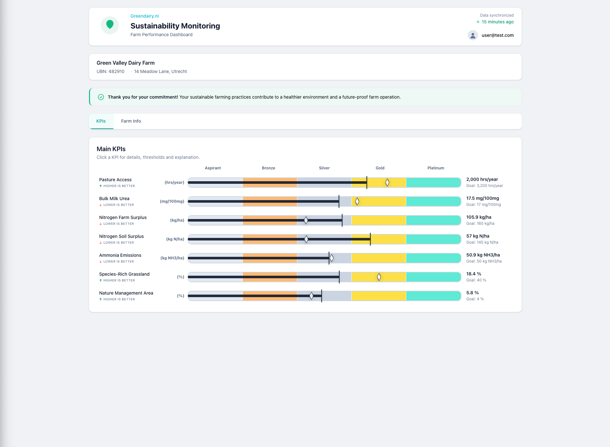

# KPI Dashboard


A sustainability KPI dashboard for agricultural farms, built to demonstrate custom data visualisation, real backend integration, and production-grade frontend engineering.

**Live demo:** <a href="https://kpi-dashboard-six-theta.vercel.app" target="_blank">kpi-dashboard-six-theta.vercel.app</a>

> No setup required. The app falls back to sample data automatically if Supabase is not configured.

---

## Highlights

- **Custom bullet chart** — built without a chart library, using a fixed 5-tier system where each tier always occupies 20% of the bar width
- **Non-linear positioning algorithm** — handles both higher-is-better and lower-is-better KPIs, needle always moves rightward on improvement
- **Optimistic updates** — plan value changes update the UI immediately with server rollback on failure
- **90+ automated tests** — including 51 Playwright E2E tests across Chromium, Firefox, and WebKit
- **Accessible modal** — keyboard navigation, focus trap, `role="dialog"`, `aria-modal`

---

## Screenshot



---

## Tech Stack

- **Frontend:** React, TypeScript
- **Styling:** styled-components
- **Backend:** Supabase (PostgreSQL + REST API)
- **Routing:** React Router v6
- **Testing:** Vitest, Testing Library, Playwright
- **Build:** Vite

---

## Overview

Farmers enrolled in sustainability programs track performance across KPIs — pasture access, nitrogen surplus, ammonia emissions, and more. Each KPI has a 5-tier scoring system (Aspirant → Platinum) with directional logic (higher-is-better vs lower-is-better).

The dashboard visualises those KPIs using a custom bullet chart, allows farmers to set target plan values, and persists changes to a real backend.

---

## Features

- **Custom bullet chart** — fixed 5-tier visual system, each tier always 20% of bar width regardless of numeric range
- **Bidirectional KPI logic** — correctly handles higher-is-better and lower-is-better KPIs
- **Real backend** — Supabase integration with optimistic updates and rollback on failure
- **Mock data fallback** — app always works without a configured backend
- **Interactive modal** — detail view with tier, plan value editor, thresholds, and explanation
- **Error boundary** — catches render errors and shows a recoverable fallback UI

---

## Architecture

```
src/
├── components/
│   ├── KPISection/
│   │   ├── KPISection.tsx              # Data fetching, state management
│   │   ├── BulletChartRow.tsx          # Individual KPI row with chart
│   │   ├── BulletChartDetailModal.tsx  # Detail view + plan value editor
│   │   ├── BulletChartMarker.tsx       # Diamond SVG marker (plan value)
│   │   ├── bulletChartRangeUtils.ts    # Core positioning algorithm
│   │   ├── mappers.ts                  # Supabase → ViewModel transformation
│   │   ├── types.ts                    # Shared TypeScript types
│   │   └── data/
│   │       └── mockKpis.ts             # Sample data fallback
│   ├── Header/
│   ├── FarmBar/
│   ├── Tabs/
│   └── ErrorBoundary.tsx
├── lib/
│   └── supabase.ts
└── test/
    ├── bulletChartRangeUtils.test.ts
    ├── mappers.test.ts
    ├── BulletChartRow.test.tsx
    ├── BulletChartDetailModal.test.tsx
    └── ErrorBoundary.test.tsx
e2e/
└── kpi.spec.ts
```

---

## Key Engineering Decisions

**Why no chart library?**

The bullet chart uses a fixed 5-tier visual system where each segment occupies exactly 20% of the bar width, regardless of numeric distance between thresholds. This non-standard scale doesn't map to any chart library abstraction — building it directly gave full control over the positioning algorithm.

**Bullet chart positioning algorithm**

The marker position is computed in four steps:

1. Determine which tier contains the KPI value
2. Calculate the relative position within that tier
3. Map that fraction onto the fixed 20% tier width
4. Invert the fraction for lower-is-better KPIs, so improvement always moves the needle rightward

**Optimistic updates**

Plan value changes update the UI immediately without waiting for Supabase to confirm. If the write fails, the UI rolls back by refetching server state — the same pattern used by Linear and Notion.

**State ownership**

KPI data is owned in local state within `KPISection`. The component treats local state as source of truth, updated on confirmed server responses. No global state library needed — the data is not shared across unrelated parts of the app.

---

## Engineering Trade-offs

**Local state vs global state**

The KPI data is owned by a single feature and not shared across the app. Introducing Redux or Zustand would add complexity for no practical gain. Local state keeps data flow explicit and easier to reason about.

**SVG vs Canvas for the chart marker**

The chart uses simple primitives (diamond marker, needle line) that benefit from DOM-level accessibility and CSS integration. SVG allows responsive layouts, styled-components styling, and accessibility attributes without the overhead of canvas rendering.

**styled-components vs Tailwind**

styled-components reflects real production experience from Be Informed, keeps styles co-located with components, and suits a project where each component is self-contained.

---

## Performance

- **No chart library** — visualisation built from styled divs and SVG primitives, keeping bundle size small
- **Memoised calculations** — segment generation and needle positioning run inside `useMemo`, scoped per row
- **Isolated row components** — plan value change only re-renders the affected row and modal
- **Stable callbacks** — event handlers wrapped in `useCallback` to prevent unnecessary child re-renders
- **Optimistic updates** — UI stays responsive while Supabase write happens in the background

---

## Accessibility

- Interactive elements are native `<button>` elements with descriptive `aria-label` attributes
- Detail modal uses `role="dialog"` and `aria-modal="true"`
- Modal traps focus — `Escape` closes, `Enter` confirms, no mouse required
- Tier information conveyed with both colour and text label — colour is never the sole indicator
- Directionality labels rendered with visible text icons alongside colour

---

## Getting Started

### Prerequisites

- Node.js 18+
- _(Optional)_ A Supabase project for plan value persistence

### Installation

```bash
git clone https://github.com/leomacode/kpi-dashboard.git
cd kpi-dashboard
npm install
npm run dev
```

The app runs on sample data by default. No Supabase account needed.

### Connecting Supabase _(optional)_

Create a `.env` file in the project root:

```
VITE_SUPABASE_URL=https://your-project.supabase.co
VITE_SUPABASE_ANON_KEY=your-anon-key
```

Then run the schema and seed data in your Supabase SQL editor. See [`supabase/schema.sql`](./supabase/schema.sql).

---

## Testing

```bash
npm run test          # Unit + component tests
npx playwright test   # 51 E2E tests across Chromium, Firefox, WebKit
```

Unit tests cover: `bulletChartRangeUtils`, `mappers`, `BulletChartRow`, `BulletChartDetailModal`, `ErrorBoundary`.

---

## Code Quality

```bash
npm run typecheck   # Zero type errors
npm run lint        # Zero warnings
npm run build       # Production build
```
